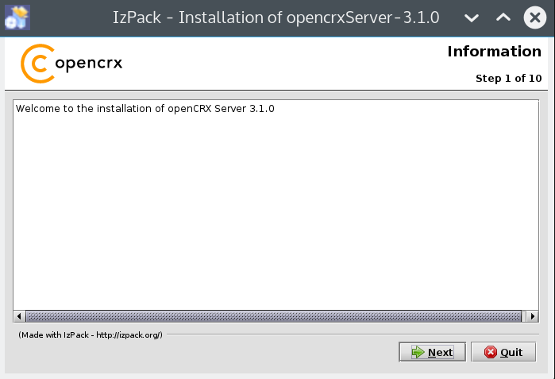
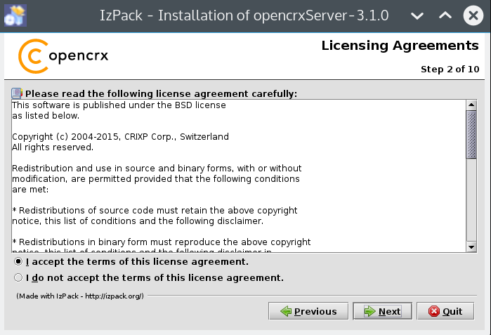
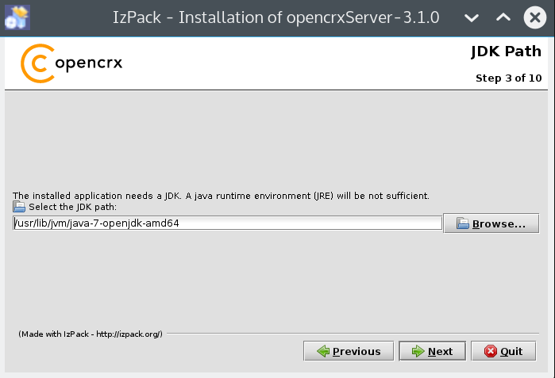
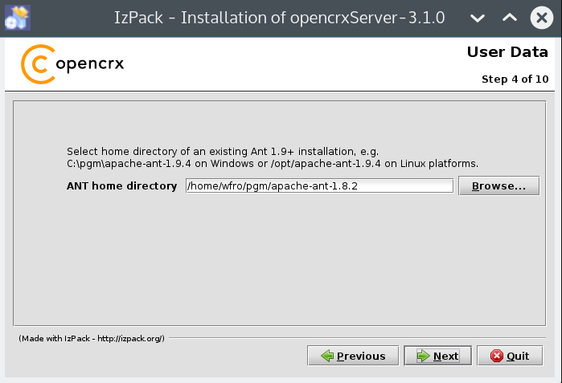
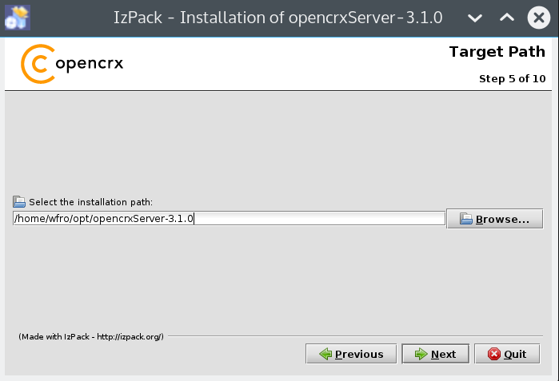
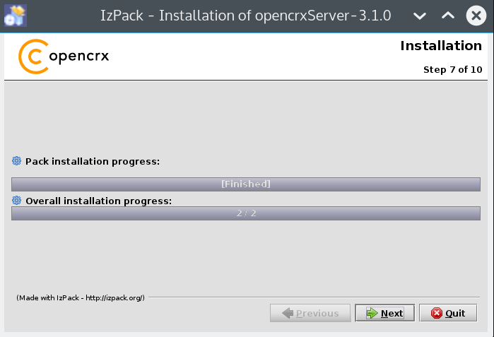
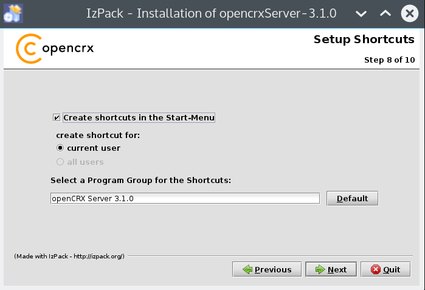
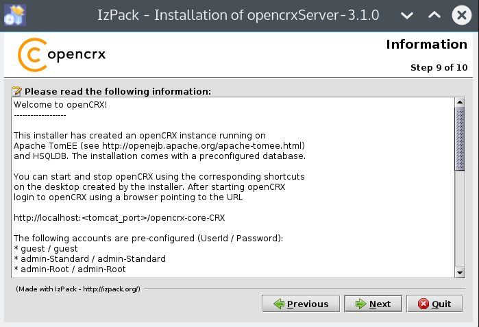
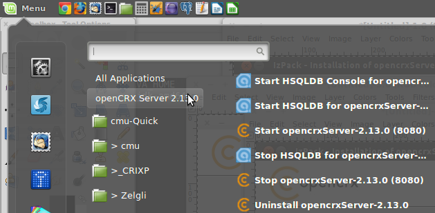

# openCRX Server Installation #
This book describes how to install an openCRX Server with the IzPack cross-platform installer 
(works on Windows, Linux, Mac OS, etc.). Please note that this is a guide to set up a runtime 
environment suitable for evaluation and testing purposes. If you intend to use openCRX in a 
production environment it is recommended that you migrate to one of the recommended database 
management systems (see guide “How to migrate openCRX database”).

openCRX is the leading enterprise-class open source CRM suite. openCRX is based on openMDX, 
an open source MDA framework based on the OMG's model driven architecture (MDA) standards. 
This guarantees total openness, compliance with all relevant standards, a state-of-the-art 
component-based architecture, and virtually unlimited scalability.

### Who this book is for ###
The intended audience are openCRX administrators and advanced users interested in evaluating openCRX.

### What you need to know with this book ###
This book describes how to install openCRX with the IzPack installer, which takes care of 
all the tricky configuration issues for you. The prerequisites are minimal (JDK and Apache Ant) 
and once they are met you should have openCRX up and running in less than 5 minutes.

## Prerequisites ##

### JDK 11 ###
Install [OpenJDK 11](https://openjdk.java.net/projects/jdk/11/).

__IMPORTANT:__

* With openCRX 5.x you really do need Java 11. Earlier versions do not work.
* It is not sufficient to have a Java Runtime Environment (JRE) only. The full-blown JDK 
  is required to run openCRX.
* On Windows, it is a good idea to avoid paths containing blanks like the default installation 
  directory ...\\Program Files\\....

### Apache Ant ###
Download and install the latest version of [Apache Ant](https://ant.apache.org/index.html) for your platform and install it by expanding the downloaded file to a directory of your choice.

### openCRX Server Installer ###
Download the openCRX Server Installer from [GitHub](https://github.com/opencrx/opencrx/releases/). The openCRX Server installer
installs Apache TomEE, the openCRX EAR, an openCRX database (HSQLDB) and various configuration files on your system.

__NOTE:__
Please note that HSQLDB is not exactly a high performance DBMS nor is it meant to be 
used as a productive DBMS for openCRX. However, it gets lots of points for "ease of installation" 
and that is what counts for getting off the ground fast. Once you're comfortable with openCRX you 
can easily migrate to another DBMS without losing any data. More information about choosing a 
suitable DBMS and migrating from HSQLDB to another DBMS is available [here](http://www.opencrx.org/faq.htm#changedb)

## Installing openCRX Server ##

* Open a console (Terminal window, DOS window, etc.) and navigate to the directory 
  that contains the openCRX IzPack installer.
* Launch the installer with the following command ((use the option -console to launch 
  the installer in text mode):


```
java -jar opencrxServer-5.1.0-installer.jre-11.jar
```


* Click _Next_ on the following screen:



* Accept the BSD License Agreement and click _Next_ again:



* Select the home directory of your JDK 11 installation (automatically selected if the environment 
  variable _JAVA\_HOME_ is set) - for example /usr/lib/jvm/java-11-openjdk-amd64 - and then click 
  _Next_ to continue:
  


* Select the home directory of your Ant installation (automatically selected if  the environment 
  variable _ANT\_HOME_ is set correctly) - for example /opt/apache-ant-1.9.4 - and then click _Next_ 
  to continue:
  


* Select the installation directory - for example /opt/opencrxServer - and then click 
  _Next_ to continue. Note that if you choose to create a new directory you will have to confirm 
  your choice by clicking _OK_ in the respective pop-up.
  


* Verify the configuration data and then click _Next_ to continue:


* openCRX Server is now being installed. Once the installation process has completed, 
  click _Next_ to continue:



* If you want the installer to create shortcuts, select options as shown below and then 
  click _Next_ to continue:



* Carefully read the README, in particular information about  valid URLs, 
  preconfigured users and passwords. Click _Next_ to continue:
  


* Finally, click _Done_ to finish:



That's it for the installation.

## Running openCRX Server ##
The installation process created various shortcuts in your Windows Start Menu 
(shortcuts/launchers in your application directory on Linux). 

__NOTE:__ Your version numbers might be different depending on the Tomcat version included in the installer.

### Starting openCRX Server ###
Launch the shortcut _Start openCRX Server 5.1.0 (8080)_.

If you did not create the shortcuts (or if the installer could not create them) you can start 
openCRX Server with the command:

Linux:

```
cd ./opencrxServer/apache-tomee-plus-8.0.3/bin
./opencrx.sh run
```

Windows:

```
cd .\opencrxServer\apache-tomee-plus-8.0.3\bin
opencrx.bat run
```

directly from a console (Terminal window, DOS window). Please note that on 
Linux/Mac platforms you might have to start the server with elevated rights, 
e.g. sudo ./opencrx.sh run.

### Connecting and Login ###
Launch your browser and load the URL

```
http://localhost:8080/opencrx-core-CRX/
```

If you want to load the login page in a specific language, 
read [here](http://www.opencrx.org/faq.htm#login) on how to do it.

### Stopping openCRX Server ###
Launch the shortcut _Stop openCRX Server 5.1.0 (8080)_.

## Next Steps ##
Now that you have successfully installed openCRX you might want to have a look at some of 
the additional documentation published [here](http://www.opencrx.org/documents.htm).
