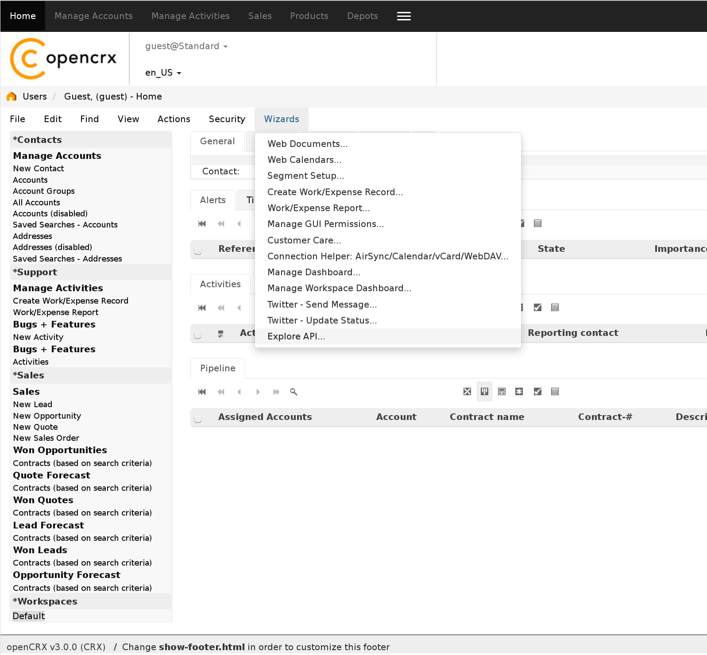
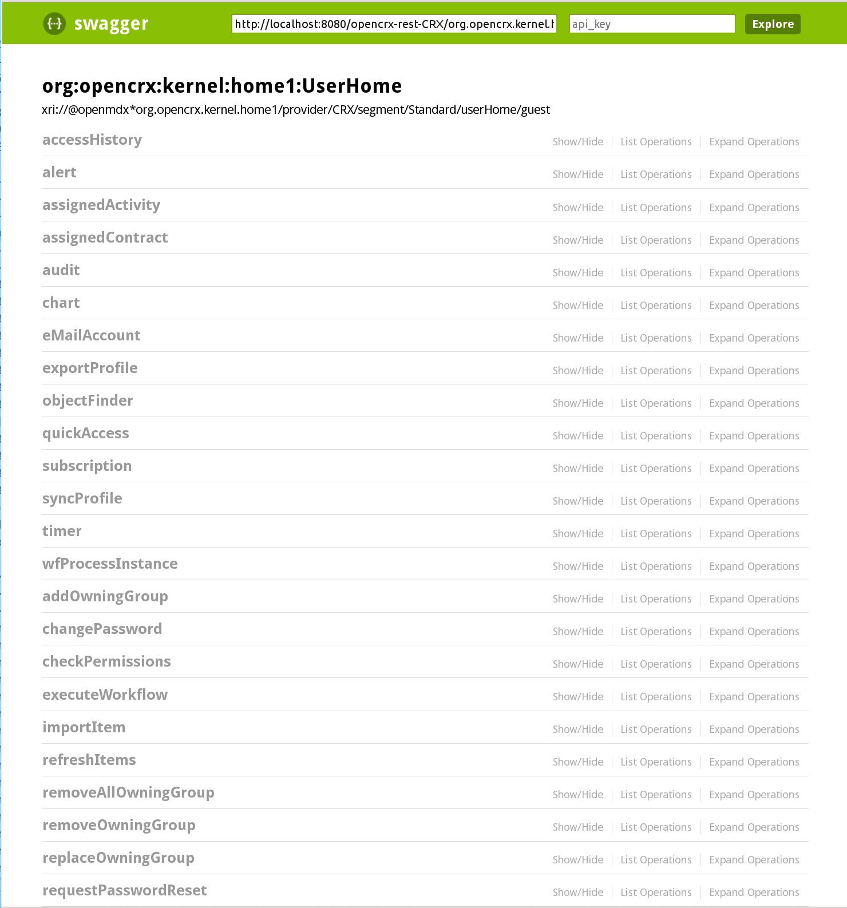

# How to use the REST API #

openCRX offers a [Swagger 2.0](http://swagger.io/)-enabled RESTful API. The [Swagger UI](https://github.com/swagger-api/swagger-ui) is embedded in the openCRX REST servlet  and allows to produce, visualize and consume the openCRX API in an easy and standardized way. The REST API gives access to the full API of openCRX, i.e. objects can be created, retrieved,  updated and deleted. In addition, operations can be invoked on all objects.

## Explore the API ##
The easiest way to launch the _Swagger UI_ is through the _Wizard > Explore API_ wizard from the _Standard GUI_:



The wizard launches the _Swagger UI_ for the _current object_, i.e. the API of the object currently displayed in the _Standard GUI_. In our example this is the _Home_ of the user _guest_:

* __Title__: Guest, (guest) - Home.
* __XRI__: The XRI is displayed in the tab _System_ which is _xri://@openmdx*org.opencrx.kernel.home1/provider/CRX/segment/Standard/userHome/guest_.



The _Swagger UI_ displays all features of the object type _org:opencrx:kernel:home1:UserHome_. The API corresponds 1:1 to the [UML class](http://www.opencrx.org/opencrx/3.0/uml/opencrx-core/home1/tn/010_Main.png.html) and the [Java class](http://www.opencrx.org/opencrx/3.0/java/org/opencrx/kernel/home1/jmi1/UserHome.html).

You can navigate to any object in the _Standard GUI_ and launch the _Explore API_ wizard.


## Mime types ##

The REST servlet supports the mime types _application/xml_ and _application/json_.


## Queries ##
Queries support the following properties which allow to filter, sort and iterate a result set:

* _position:_ the result set starts from the given position. The default is 0. Increasing the position by a batch size allows to iterate the result set. _hasMore=false_ indicates that there are no more objects to be returned.
* _size:_ specifies the batch size. The default is 25.
* _queryType:_ specifies the type of the objects to be returned. For example the reference XRI _org.opencrx.kernel.account1/provider/CRX/segment/Standard/account_ returns objects which are instanceof _org:opencrx:kernel:account1:Account_, i.e. objects of type _org:opencrx:kernel:account1:Contact_, _org:opencrx:kernel:account1:LegalEntity_, _org:opencrx:kernel:account1:UnspecifiedAccount_, _org:opencrx:kernel:account1:Group_. Setting the _queryType_ to _org:opencrx:kernel:account1:Contact_ restricts the result set to objects which are instanceof _org:opencrx:kernel:account1:Contact_.
* _query:_ a query which is a semicolon-separated list of query verbs. The list of verbs is specified by the methods of the query class. The name of the query class is derived from the _queryType_. E.g. for _org:opencrx:kernel:account1:Contact_ the corresponding query class is _org.opencrx.kernel.account1.cci2.ContactQuery_.

Here is a list of sample query URLs:

```
http://localhost:8080/opencrx-rest-CRX/org.opencrx.kernel.account1/provider/CRX/segment/Standard/account
http://localhost:8080/opencrx-rest-CRX/org.opencrx.kernel.account1/provider/CRX/segment/Standard/account?position=0&size=50&queryType=org:opencrx:kernel:account1:Contact&query=modifiedAt().between(:datetime:20080101T000000.000Z,:datetime:20101001T000000.000Z);orderByFirstName().ascending()
http://localhost:8080/opencrx-rest-CRX/org.opencrx.kernel.account1/provider/CRX/segment/Standard/account?position=0&size=50&queryType=org:opencrx:kernel:account1:Contact&query=thereExistsNumberOfChildren().greaterThan(:integer:-1);orderByFirstName().ascending()
http://localhost:8080/opencrx-rest-CRX/org.opencrx.kernel.account1/provider/CRX/segment/Standard/account?position=0&size=50&queryType=org:opencrx:kernel:account1:Contact&query=thereExistsNumberOfChildren().lessThan(0);orderByFirstName().ascending()
http://localhost:8080/opencrx-rest-CRX/org.opencrx.kernel.account1/provider/CRX/segment/Standard/account?position=0&size=50&queryType=org:opencrx:kernel:account1:Contact&query=thereExistsNumberOfChildren().lessThan(3);orderByFirstName().ascending()
http://localhost:8080/opencrx-rest-CRX/org.opencrx.kernel.account1/provider/CRX/segment/Standard/account?position=0&size=50&queryType=org:opencrx:kernel:account1:Contact&query=thereExistsFullName().like(%22.*Test.*%22);orderByFirstName().ascending()
http://localhost:8080/opencrx-rest-CRX/org.opencrx.kernel.account1/provider/CRX/segment/Standard/account?position=0&size=50&queryType=org:opencrx:kernel:account1:Contact&query=thereExistsFirstName().equalTo(%22Guest%22);orderByLastName().ascending()
http://localhost:8080/opencrx-rest-CRX/org.opencrx.kernel.account1/provider/CRX/segment/Standard/account?position=0&size=50&queryType=org:opencrx:kernel:account1:Contact&query=thereExistsFirstName().equalTo(%22Guest%22)
```


## Unit Of Work handling ##

By default the REST servlet runs in auto-commit mode, i.e. each invocation runs within its
own unit of work (UOW). However, the REST servlet also allows clients to control the UOW
handling and therefore to group multiple invocations in one unit of work (UOW). In a first
step the REST servlet must be put in non auto-commit mode by starting a virtual connection. 
Then a UOW can be controlled with the operations begin, commit and rollback.

__IMPORTANT__: it is the REST client's responsibility to keep the HTTP session alive across
all invocations (handling of _Set-Cookie_ and _JSESSIONID_). The non auto-commit mode is maintained
per HTTP session.

### New connection ###

__URL__
A virtual connection must be started to put the REST servlet in non auto-commit mode. It
attaches a persistence manager to the servlet session. This persistence manager is then used 
for the UOW handling for the succeeding calls. 

__IMPORTANT__: The value of the parameter UserName must match 
the authenticated user's name. The parameter is optional in versions openCRX 2.9.1+.

```
http://localhost:8080/opencrx-rest-CRX/org:openmdx:kernel/connection?UserName=guest
```
__Method__

```
POST
```
__Request Body__
The operation takes a parameter of type _org.openmdx.base.Void_.

```
<?xml version="1.0" encoding="UTF-8"?>
<org.openmdx.base.Void />
```
__Response Body__

```
```

### Begin UOW ###

__URL__
Start the UOW, i.e. the REST servlet retrieves the persistence manager of the current session
and invokes _pm.currentTransaction().begin()_. The client must keep the transaction-id.
It is required for the commit and rollback operations.

```
http://localhost:8080/opencrx-rest-CRX/org:openmdx:kernel/transaction
```
__Method__

```
POST
```
__Request Body__
The operation takes a parameter of type _org.openmdx.kernel.UnitOfWork_.

```
<?xml version="1.0" encoding="UTF-8"?>
<org.openmdx.kernel.UnitOfWork id="transaction"/>
```
__Response Body__

```
<?xml version="1.0" encoding="UTF-8"?>
<org.openmdx.kernel.UnitOfWork id="<transactin-id>" href="http://localhost:8080/opencrx-rest-CRX/org.openmdx.kernel/transaction/<transaction-id>"/>
```

### Commit UOW ###
__URL__
Commit the UOW, i.e. the REST servlet retrieves the pm of the current session
and invokes _pm.currentTransaction().commit()_.

```
 http://localhost:8080/opencrx-rest-CRX/org:openmdx:kernel/transaction/<transaction-id>/commit
```
__Method__

```
POST
```
__Request Body__
The operation takes a parameter of type _org.openmdx.base.Void_.

```
<?xml version="1.0" encoding="UTF-8"?>
<org.openmdx.base.Void />
```
__Response Body__

```
<?xml version="1.0" encoding="UTF-8"?>
<org.openmdx.base.Void id="result" href="http://localhost:8080/opencrx-rest-CRX/org.openmdx.kernel/transaction/<transaction-id>/commit*-"/>
```

### Rollback UOW ###
__URL__
Rollback the UOW, i.e. the REST servlet retrieves the persistence manager of the current session
and invokes _pm.currentTransaction().rollback()_.

```
http://localhost:8080/opencrx-rest-CRX/org.openmdx.kernel/transaction/<transaction-id>
```
__Method__

```
DELETE
```

## Debugging

Putting a proxy between a native openCRX client and server allows you to inspect the REST interactions. The helps in cases where complex REST
request bodies need to be created such as for nested queries. Good proxy servers for debugging purposes are
[Grinder TCPProxy](http://grinder.sourceforge.net/index.html) or [socat on Linux](https://linux.die.net/man/1/socat).

[How to write a remote openCRX Java client](RemoteJavaClient.md) describes how to create a native, remote Java client. Further examples can also be found
[here](https://github.com/opencrx/opencrx/tree/master/core/src/test/java/org/opencrx/kernel/api).

Once the remote Java client is working you are ready to work with a proxy. It is expected that the openCRX server is running at 
`http://127.0.0.1:8080/opencrx-rest-CRX`.

Start Grinder as follows:

```
java -cp lib/grinder.jar net.grinder.TCPProxy -console -responsefilter NONE -localhost 127.0.0.1  -localport 7180 -remotehost http://127.0.0.1 -remoteport 8080
```

Start the openCRX client with the following configuration:

```
entityManagerFactory = org.opencrx.kernel.utils.Utils.getPersistenceManagerFactoryProxy(
	"http://127.0.0.1:7180/opencrx-rest-CRX/", // local proxy, e.g. Grinder
	USER_NAME, 
	USER_PASSWORD, 
	"application/json" // or "text/xml"
);
```

Watch the output of Grinder. The request bodies can be used as templates for native REST clients.
